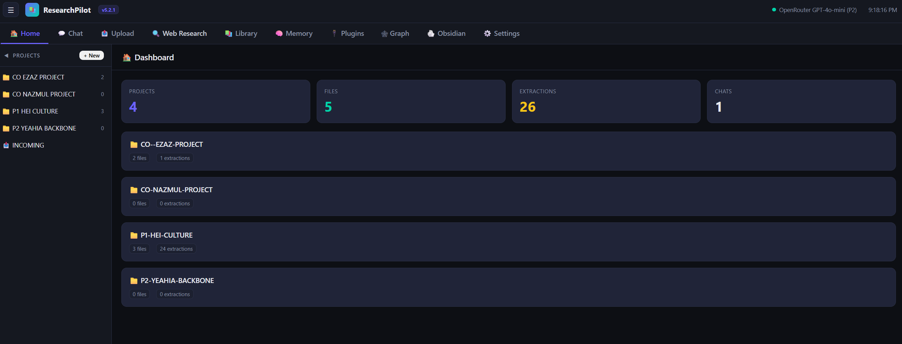
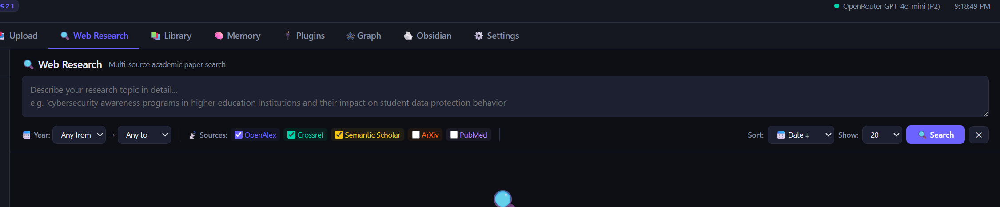
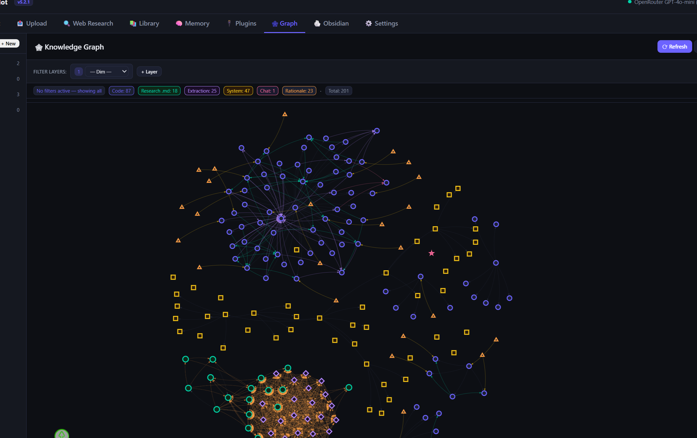

# ResearchPilot

> **AI-native research infrastructure for academics or students.**  
> Ingest papers, extract insights via AI, search across 5 academic databases, visualise knowledge graphs, and write with RAG-powered chat — all self-hosted, all local-first.

---

> `CLAUDE.md` contains AI behaviour instructions for Claude Code integration — optional, safe to ignore.

##  Overview

ResearchPilot is a self-hosted research assistant that connects to multiple AI backends (Ollama, Gemini, Claude, OpenRouter, etc.) and provides a complete workflow for academic research:

- **Ingest** any file (PDF, DOCX, PPTX, HTML, TXT, MD) — auto-converts to Markdown
- **Extract** papers using the 12-point Elite Extraction Protocol via AI
- **Search** across 5 academic databases (OpenAlex, Crossref, Semantic Scholar, ArXiv, PubMed)
- **Visualize** research with a multi-dimension knowledge graph
- **Chat** with AI using your research library as RAG context
- **Track** keywords, predatory journals, and version changelog

---

<p align="center">
  
  <br><em>Dashboard — chat with multiple AI engines, manage conversations</em>
  <br><br>
  
  <br><em>Knowledge Graph — visualise research across author, year, journal, method, and more</em>
  <br><br>
  
  <br><em>Database Search — discover papers across 5 academic databases with AI-powered extraction</em>
</p>

---

##  Prerequisites

| Requirement | Minimum |
|-------------|---------|
| **Python** | 3.10+ (tested on 3.11) |
| **OS** | Windows 10+ / Linux / macOS |
| **Ollama** (optional) | Install from [ollama.com](https://ollama.com) and pull a model (`ollama pull llama3`) |
| **Disk space** | ~500 MB for dependencies + your papers |

---

##  Quick Start

### 1. Install

```bash
# Clone or download
cd ResearchPilot/web-app

# Install dependencies
pip install -r requirements.txt
```

### 2. Configure AI

Copy and edit the environment file:

```bash
cp .env.example .env
```

Set at least one AI key (or use local Ollama):

| Engine | How to Get |
|--------|-----------|
| **Ollama** (free, local) | Install from [ollama.com](https://ollama.com), pull a model like `llama3` |
| **Gemini** (free tier) | Get key at [aistudio.google.com](https://aistudio.google.com/app/apikey) |
| **Claude** | API key from [console.anthropic.com](https://console.anthropic.com) |
| **OpenRouter** (free models) | Key from [openrouter.ai](https://openrouter.ai) |

### 3. Run

```bash
python main.py
```

Open **http://127.0.0.1:8000** in your browser.

>  **Windows users:** Double-click `START-SERVER.bat`

---

##  Features

###  Universal File Ingestion
| Format | Auto-converts to .md |
|--------|:---:|
| PDF | ✅ (via PyMuPDF or Docling) |
| DOCX / DOC | ✅ |
| PPTX / PPT | ✅ |
| HTML / HTM | ✅ |
| TXT / CSV / JSON | ✅ |

###  Multi-AI Engine Router
Tries enabled engines in priority order. First one that responds wins — **your AI never stops**.

Supported: `Ollama` · `LM Studio` · `Gemini` · `Claude (API)` · `Claude (CLI)` · `OpenRouter` · `Custom OpenAI-compatible`

###  Academic Web Search
Search across 5 sources simultaneously:

- **OpenAlex** — 250M+ works
- **Crossref** — scholarly publishing metadata
- **Semantic Scholar** — AI-powered paper discovery
- **ArXiv** — pre-prints
- **PubMed** — biomedical literature

With automatic predatory journal filtering, PDF download, and 12-point AI analysis.

###  Knowledge Graph
Visualize your research across 7 dimensions:

`Author` · `Year` · `Journal` · `Quartile` · `Method` · `Framework` · `Keyword`

Multi-layer filtering with AND/OR logic. Built-in Obsidian vault integration.

###  12-Point Extraction Protocol
Every paper is analyzed through:

1. The Problem
2. The Gap
3. Research Question(s)
4. Purpose / Objective
5. Theory / Framework
6. Methodology
7. Key Findings
8. Contribution
9. Limitations
10. Implications
11. Key Citations
12. Critical Position

###  Chat with RAG
Chat with any enabled AI engine. Automatically injects relevant context from your research library — no manual file selection needed.

---

##  Project Structure

```
ResearchPilot/
├── web-app/                          # FastAPI web application
│   ├── main.py                       # Server + all API endpoints (~3100 lines)
│   ├── requirements.txt              # Python dependencies
│   ├── .env.example                  # Environment template
│   ├── static/
│   │   └── index.html               # Single-page frontend (~2400 lines)
│   ├── START-SERVER.bat             # Windows launcher
│   └── test_final.py                # Test suite
├── 00-SYSTEM-CORE/                   # System protocols, master knowledge base
├── 01-PROJECTS/                      # Research projects (P1, P2, ...)
├── 99-SYSTEM-BACKEND/               # Chats, logs, automation reports
├── INCOMING/                         # Landing zone for new papers
├── .gitignore
└── README.md                        # This file
```

---

##  Settings

Accessible from the UI: **Settings →**  

| Section | Purpose |
|---------|---------|
| AI Engines | Configure and enable/disable AI backends |
| Skills | Custom markdown instructions loaded with every chat |
| Projects | Create, rename, delete research projects |
| Knowledge Base | Read-only view of the master synthesis |
| Keywords | Auto-scan and track research keywords |
| Predatory Journals | Manage filtered journal list |
| General | Context size, auto-extract, auto-start |
| Author | Display information |
| Changelog | Record version history |

---

##  Security Notes

- Server binds to `127.0.0.1` by default (localhost only)
- API keys are stored locally in `settings.json` (excluded from git)
- Uploaded files are sanitized and limited to 500MB
- Path traversal is blocked on all file endpoints

---

##  Author

**Md Yeahia Bhuiyan**
*PhD Researcher · University Lecturer · AI Systems Designer*

I am a researcher and educator specialising in cybersecurity behaviour, organisational culture, and privacy mental models in Higher Education Institutions. My work bridges qualitative academic research and applied AI systems design.

ResearchPilot was built as part of a broader effort to construct portable, AI-assisted research infrastructure — systems that reduce cognitive overhead, preserve research continuity, and support publication-quality output across long-term academic projects.

**Research Interests**
Cybersecurity behaviour · Privacy mental models · Organisational culture · Protection Motivation Theory · AI-assisted academic workflows

**Connect**
- GitHub: [your-github-handle]
- Institution: [your institution, optional]
- Contact: [your email or profile link, optional]

---


